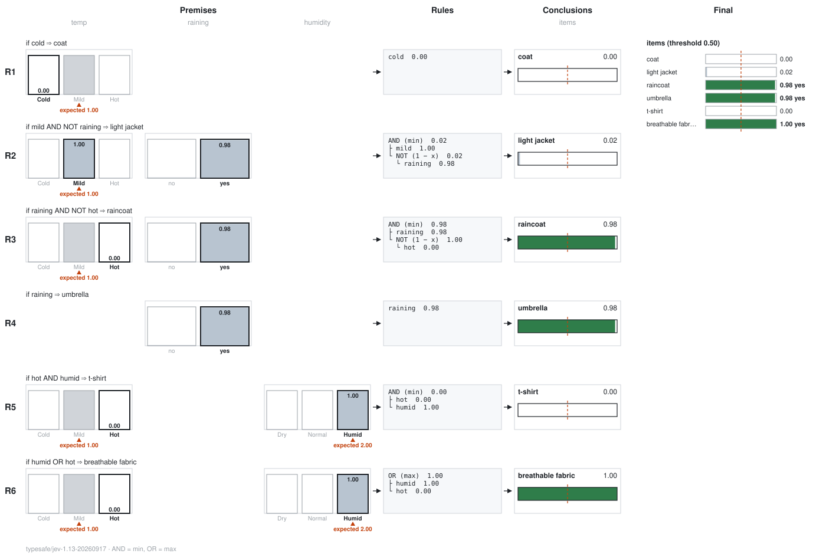
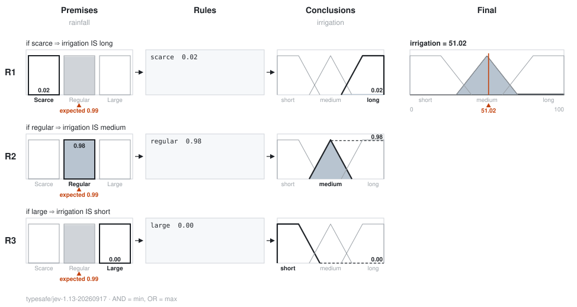

# fuzzy-jev

[](https://github.com/dsaad68/fuzzy-jev/actions/workflows/ci.yml)
[](https://github.com/dsaad68/fuzzy-jev/actions/workflows/release.yml)
[](https://www.rust-lang.org)
[](https://github.com/dsaad68/fuzzy-jev/releases)
[](https://typesafe.ai)
[](https://openrouter.ai)
[](LICENSE)

Ask **Jev** typed questions about a piece of text and get probabilities back, rather than prose. A **Choice** between named options, a **Score** on an ordered scale, or a **Noul** —
the probability that something is true.

Jev is [TypeSafe](https://typesafe.ai)'s model. This client reaches it through
[OpenRouter](https://openrouter.ai), which serves it on the decisions endpoint
(`https://openrouter.ai/api/alpha/decisions`), so the key you need is an OpenRouter one;
`--url` points the same questions at another endpoint.

A [rules file](#fuzzy-rules) is a policy over those answers: it reads each probability as the
degree to which a condition holds, and combines them with `AND`, `OR`, `NOT` and hedges into a
support score per decision, or into a crisp amount through [fuzzy outputs](#outputs-a-crisp-amount).
A support score is the policy's, not a probability: [what the numbers mean](docs/rules.md#what-the-numbers-mean).
`--svg` [draws the whole rule base](#drawing-the-rules). **[`docs/rules.md`](docs/rules.md)** is the
full guide to `rules.toml`: every table, operator and formula, the output formats, the errors, and
an example worked by hand.



A command for your terminal, a Rust library that also compiles for `wasm32-unknown-unknown`, a
[Python package](docs/python.md), and an [Agent Skill](#the-agent-skill) that teaches a coding agent when to ask Jev instead of judging
by eye — `jev add skill` writes it into your project. The crate and the command are both called
`jev`.

```sh
export OPENROUTER_API_KEY=sk-or-...

jev 'Help! My payouts have been failing for 3 days.' \
  --noul 'is_urgent=Does this message convey urgency?' \
  --choice 'department=Which team should handle this?|billing:Payments, invoicing, refunds|technical:Bugs, outages, integrations|sales:Pricing, upgrades, new accounts' \
  --score 'frustration=How frustrated is the customer?|Calm|Frustrated|Very angry'
```

```text
is_urgent    0.95 yes
department   billing  confidence 0.84  (billing 0.89, technical 0.11, sales 0.00)
frustration  1.04 of 2, nearest "Frustrated"  confidence 0.94
427 tokens in, 73 out, $0.000018, typesafe/jev-1.13-20260917
```

Every question sees the same state and is answered on its own, so ask all of them in one call: an
extra question costs a few tokens and no extra round trip.

## Install

**From crates.io.** The package is `fuzzy-jev`, since `jev` on crates.io is another project; the
command it installs is `jev`. Needs a [Rust toolchain](https://rustup.rs).

```sh
cargo install fuzzy-jev --locked
```

It lands in `~/.cargo/bin`, which rustup puts on your PATH, so `jev` works in any folder.
`cargo install fuzzy-jev --locked --force` updates it; `cargo uninstall fuzzy-jev` takes it off
your PATH again.

**A built binary.** Each [release](https://github.com/dsaad68/fuzzy-jev/releases) carries a
`.tar.gz` per platform — Linux and macOS, x86-64 and Arm — with a `.sha256` beside it:

```sh
tar -xzf jev-0.2.0-aarch64-apple-darwin.tar.gz
./jev --help
```

v0.1.0, from before this repository was renamed, has no fuzzy rules or drawing.

**With cargo, from this repository.** For what is on `main` before it is released, with no
clone: cargo fetches the source and builds it.

```sh
cargo install --git https://github.com/dsaad68/fuzzy-jev --locked
```

A few variants:

```sh
# a particular release
cargo install --git https://github.com/dsaad68/fuzzy-jev --tag v0.2.0 --locked

# a branch, to try something before it is merged
cargo install --git https://github.com/dsaad68/fuzzy-jev --branch some-branch --locked

# over an older copy, when cargo says one is already installed
cargo install --git https://github.com/dsaad68/fuzzy-jev --locked --force
```

`--locked` builds with the dependency versions in `Cargo.lock`, which is what CI tested; leave it
out to let cargo pick newer ones. To run it from a clone instead:

```sh
git clone https://github.com/dsaad68/fuzzy-jev
cd fuzzy-jev
cargo install --path . --locked      # or: cargo run -- --help
```

Then set `OPENROUTER_API_KEY` from an [OpenRouter key](https://openrouter.ai/keys). `--dry-run`
prints the request instead of sending it, and needs no key.

**From Python.** `pip install fuzzy-jev`, then `import jev`: see [From Python](#from-python).

## Asking

A question on the command line is `ID=INSTRUCTIONS`, then `|`-separated criteria:

| Flag | Criteria |
| --- | --- |
| `--noul` | none, or `WHAT YES MEANS\|WHAT NO MEANS` |
| `--choice` | two or more options, each `NAME` or `NAME:DESCRIPTION` |
| `--score` | two to ten levels, lowest first |

Each flag can be repeated, and the answers print in the order the questions were written. Text
with a `|` in it, or structured criteria, goes in a JSON file of ids to questions passed with
`--questions` (`-q`); file questions come first, then the flags'.

| Option | |
| --- | --- |
| `STATE` | The state, as text. Without it, it's read from `--state-file` (`-f`, `-` for standard input), or from standard input when that isn't a terminal. |
| `--state-json` | Parse the state as JSON: `cat ticket.json \| jev --state-json -q questions.json` |
| `--model` (`-m`) | Another model; the default is TypeSafe's `typesafe/jev-1.13`. |
| `--url` | Another endpoint. With one, `OPENROUTER_API_KEY` may be unset, for an endpoint that adds the key. |
| `--text` | One line per question. The default. |
| `--table` | A table: question, type, answer, confidence, and every option's probability. |
| `--json` | The reply as this crate reads it (the fields it knows, re-encoded), for `jq` and scripts. |
| `--rules` (`-r`) | [Fuzzy rules](#fuzzy-rules) over the answers, from a TOML file; prints their outcome instead of the answers. |
| `--graph` | With `-r`: [draw the rules](#drawing-the-rules) in the terminal. |
| `--svg PATH` | With `-r`: draw the rules as an SVG image. Without a state, either one draws the structure alone, with no call. |
| `--timeout SECONDS` | Give up on the request after this long; 60 by default. It is not sent again. |
| `--dry-run` | Print the request instead of sending it. No key needed. |

### A structured state

`--state-json` sends the state as JSON rather than as text, so nested fields, numbers and lists
reach the model as what they are. A support ticket, `ticket.json`:

```json
{
  "subject": "Charged twice for the October invoice",
  "plan": "enterprise",
  "opened_days_ago": 6,
  "prior_escalations": 2,
  "messages": [
    {"from": "customer", "text": "We were billed EUR 4,800 twice on 3 October. Please refund one."},
    {"from": "support", "text": "Thanks, looking into it."},
    {"from": "customer", "text": "Six days now and no answer. Our finance team is escalating."}
  ]
}
```

The three question types, in one `questions.json`. A noul's criteria are keyed `true` and `false`,
which is what the endpoint calls them — the `--noul` flag spells the same thing
`id=INSTRUCTIONS|WHAT YES MEANS|WHAT NO MEANS`:

```json
{
  "team": {
    "type": "choice",
    "instructions": "Which team should own this ticket?",
    "criteria": {
      "billing": "charges, invoices, refunds",
      "support": "the product itself, bugs, outages",
      "success": "the relationship, renewals, escalations"
    }
  },
  "urgency": {
    "type": "score",
    "instructions": "How urgently does this need a human today?",
    "criteria": ["Can wait a week", "This week", "Today", "Now"]
  },
  "churn_risk": {
    "type": "noul",
    "instructions": "Is this account at risk of leaving?",
    "criteria": {"true": "Threats, repeated escalation, money at stake", "false": "Routine, patient, one-off"}
  }
}
```

```sh
cat ticket.json | jev --state-json -q questions.json
```

```text
team        billing  confidence 0.99  (billing 0.99, success 0.01, support 0.00)
urgency     2.48 of 3, nearest "Today"  confidence 0.52
churn_risk  0.86 yes
571 tokens in, 72 out, $0.000024, typesafe/jev-1.13-20260917
```

The numbers move a little from call to call, so a threshold is worth setting with a margin rather
than at the value one run happened to give.

With `--json`, each answer is named after its type — `.noul`, `.choice` (with `.confidence` and
`.probabilities`), `.score` — which is what a script gates on:

```sh
cat ticket.json | jev --state-json -q questions.json --json > answers.json
jq -r 'if .answers.churn_risk.noul > 0.8 then "page the account team" else "queue normally" end' answers.json
```

## Fuzzy rules

> **The complete reference is [`docs/rules.md`](docs/rules.md).** This section is the short tour.

A decision is often several answers combined: "a raincoat when it rains, unless it's hot". A
**rules file** says that directly. It names the answers it needs as **terms**, combines them with
fuzzy logic, and gives each outcome a **support score**. The rules are your policy; Jev supplies the
evidence. Reading a probability as a degree is a modelling choice, so a score says how strongly the
policy supports an outcome, not how likely it is.

The questions, [`examples/rules/weather.json`](examples/rules/weather.json):

```json
{
  "temp":     {"type": "score",
               "instructions": "How warm is it outside? Cold is under 10 °C, Mild 10 to 22 °C, Hot over 22 °C; …",
               "criteria": ["Cold", "Mild", "Hot"]},
  "humidity": {"type": "score",
               "instructions": "How humid is the air? Dry is under 40% relative humidity, Normal 40 to 70%, Humid over 70%; …",
               "criteria": ["Dry", "Normal", "Humid"]},
  "raining":  {"type": "noul",
               "instructions": "Is it raining, or about to?",
               "criteria": {"true": "Rain is falling, or the state says it is about to start", "false": "No rain, and none expected soon"}}
}
```

The rules, [`examples/rules/wear.toml`](examples/rules/wear.toml):

```toml
[logic]                  # optional
and = "min"              # min | product | lukasiewicz
or  = "max"              # max | probsum | bounded

[decide]                 # optional
threshold = 0.5

[terms]
cold    = "temp.Cold"    # a Score level, by its exact text
mild    = "temp.Mild"
hot     = "temp.Hot"
humid   = "humidity.Humid"
raining = "raining"      # a Noul, by its id
# stormy = "sky.storm"   (a Choice option, from a "sky" choice: clear, cloudy, storm)

[[rule]]
if   = "cold"
then = "coat"

[[rule]]
if   = "mild AND NOT raining"
then = "light jacket"

[[rule]]
if   = "raining AND NOT hot"
then = "raincoat"

[[rule]]
if   = "raining"
then = "umbrella"

[[rule]]
if   = "hot AND humid"
then = "t-shirt"

[[rule]]
if     = "humid OR hot"
then   = "breathable fabric"
weight = 1.0             # optional, 0 to 1; the rule's score is multiplied by it
```

```sh
jev '16°C, the air feels sticky, and a light drizzle has started.' \
  -q examples/rules/weather.json -r examples/rules/wear.toml
```

```text
coat               0.00
light jacket       0.02
raincoat           0.98  yes
umbrella           0.98  yes
t-shirt            0.00
breathable fabric  1.00  yes
threshold 0.50
475 tokens in, 47 out, $0.000020, typesafe/jev-1.13-20260917
```

- **Terms** are lowercase names, and every word in a rule is a term or an operator. A term points
  at a Noul by its id, at a Score level by the question id, a `.`, and the level's exact text, or at
  a Choice option by its name.
- **Operators** are uppercase: `AND`, `OR`, `NOT`, parentheses, and the hedges `VERY` (x²),
  `SOMEWHAT` (√x), `EXTREMELY` (x³) and `INDEED` (pushed toward 0 or 1). Hedges and `NOT` bind
  tightest, then `AND`, then `OR`. A hedge reshapes a score and moves where the threshold falls;
  it doesn't make "angry" mean "very angry".
- **`[logic]`** picks the AND and the OR for the whole file. `min` and `max`, the defaults, let the
  weakest condition and the strongest reason decide. `product` and `probsum` make every doubt lower
  the score and every reason raise it, and `probsum` counts a reason written twice twice. None of
  them is the probability of a compound event; levels of one question exclude each other, so their
  probabilities add (`bounded`).
- **Rules with the same `then`** are joined by the file's OR, and an item is a yes at or over the
  threshold.
- **Checked before the call.** Every term is resolved against the questions first, so a typo costs
  nothing, and `--dry-run` catches it too. The error names what does exist:
  ``[terms] hot: `temp` has no level `hot`; its levels are `temp.Cold`, `temp.Mild`, `temp.Hot` ``.
  An answer or a probability missing from the reply is an error, never a silent zero, and so is a
  number that isn't a probability or a distribution that doesn't add up to 1.
- **`--table`** adds the rules behind each score, and **`--json`** prints
  `{"reply": …, "outcome": …}`, so a script keeps every answer.

### Outputs: a crisp amount

When the answer is an amount ("how long to water?") rather than a yes, a rule can conclude in an
**output**: a crisp axis with named fuzzy sets. A set's rules are joined into its score, each set is
clipped at its score, the clipped shapes are merged with the file's OR, and the value is the centre
of the merged shape, worked out exactly. This is Mamdani inference with centroid defuzzification.

[`examples/rules/irrigation.toml`](examples/rules/irrigation.toml), with
[`examples/rules/rain.json`](examples/rules/rain.json) asking how much it rained:

```toml
[terms]
scarce  = "rainfall.Scarce"
regular = "rainfall.Regular"
large   = "rainfall.Large"

[output.irrigation]          # minutes of watering this week
range  = [0, 100]
short  = [0, 0, 20, 40]      # a trapezoid: rises a→b, flat b→c, falls c→d
medium = [30, 50, 70]        # a triangle: a, peak, c
long   = [60, 80, 100, 100]  # a shoulder, held up to the end of the range

[[rule]]
if   = "scarce"
then = "irrigation IS long"

[[rule]]
if   = "regular"
then = "irrigation IS medium"

[[rule]]
if   = "large"
then = "irrigation IS short"
```

```sh
jev 'A fairly normal week: two moderate showers, and the soil is damp but drying at the surface.' \
  -q examples/rules/rain.json -r examples/rules/irrigation.toml
```

```text
irrigation  51.02  (short 0.00, medium 0.98, long 0.02)
```

`then = "OUTPUT IS SET"` always concludes in an output, and a misspelt one is an error that
suggests the closest name; any other `then` is an item, and one file can have both. The value says
where the support lies, not how much of it there is, so read it with its sets' scores, printed
beside it. When no rule for an output scores above zero, its value is `-` (`null` in JSON) rather
than a made-up number. The file has no units: say them in a comment, as above.

For everything together (a Choice, hedges, parentheses, a weight, `probsum`, a threshold, and items
alongside an output), see the support-triage example,
[`examples/rules/triage.toml`](examples/rules/triage.toml), which
[`docs/rules.md`](docs/rules.md#a-complete-example-worked-by-hand) works through by hand.

## Drawing the rules

`--svg PATH` draws the rules as an image, and `--graph` draws them in the terminal. Without a
state (no argument, no `-f`, nothing on standard input) or with `--dry-run`, either one draws the
structure alone and makes no call, which is a free way to check a rules file. With a state, every
part carries its number.

```sh
jev '16°C, the air feels sticky, and a light drizzle has started.' \
  -q examples/rules/weather.json -r examples/rules/wear.toml --svg wear.svg
```

That is the drawing at the top of this page. The image is laid out the way a fuzzy rule base is usually drawn, with one row per rule:

- **Premises:** a column per question, with a bar per level, option, or no and yes, filled to its
  probability; the one a rule reads is in bold. Under a Score, the red arrow is its expected level,
  drawn apart because the rules don't read it. A probability the reply leaves out is marked
  `missing`.
- **Rules:** the `if` as a tree of its operators, each with what it came to.
- **Conclusions:** an output's sets, with the rule's own set clipped at its score, or an item's bar
  against the threshold.
- **Final:** each output's merged shape with an arrow at its centroid, and every item's score.

With an output, the conclusions are its sets clipped at each rule's score, and the final column is
their merged shape with an arrow at its centroid. The irrigation rules:

```sh
jev 'A fairly normal week: two moderate showers, and the soil is damp but drying at the surface.' \
  -q examples/rules/rain.json -r examples/rules/irrigation.toml --svg irrigation.svg
```



In the terminal, `--graph` prints each rule as a tree, and each term with every level's
probability (the term's own in brackets):

```text
R3  raining AND NOT hot  ⇒  raincoat
    AND (min)  0.98
    ├─ raining  0.98  ← raining: no 0.02 · [yes 0.98]
    └─ NOT (1 − x)  1.00
       └─ hot  0.00  ← temp: Cold 0.00 · Mild 1.00 · [Hot 0.00]
    ⇒ raincoat  0.98  ███████████████████▋
```

An output is drawn as a plot of its merged shape, with `↑` at its centre:

```text
  irrigation = 51.02
  1.0 ┤░░░░░░░░░░░░░               ▃▆▆▃               ░░░░░░░░░░░░░
      │░░░░░░░░░░░░░░░░         ▁▄██████▄▁         ░░░░░░░░░░░░░░░░
      │░░░░░░░░░░░░░░░░░░     ▂▅██████████▅▂     ░░░░░░░░░░░░░░░░░░
      │░░░░░░░░░░░░░░░░░░░░░▃▇██████████████▇▃░░░░░░░░░░░░░░░░░░░░░
      │░░░░░░░░░░░░░░░░░░▁▄████████████████████▄▁▁▁▁▁▁▁▁▁▁▁▁▁▁▁▁▁▁▁
  0.0 └──────────────────────────────┬─────────────────────────────
       0                             ↑ 51.02                    100
           short                  medium                  long
```

## The Agent Skill

A coding agent asked to "sort these tickets" or "which of these need a human?" will usually read
them itself and write a paragraph of opinion. The skill teaches it to reach for `jev` instead: one
call, a probability per item, and a number it can threshold on.

```sh
cd your-project
jev add skill
```

```text
created .agents/skills/jev/SKILL.md
created .agents/skills/jev/references/patterns.md
The jev skill is in .agents/skills/jev. Agents that read .agents will find it.
```

| | |
| --- | --- |
| `jev add skill` | writes it to `.agents/skills/jev`, the convention most agents read |
| `jev add skill --claude` | writes it to `.claude/skills/jev` instead |
| `jev add skill --tool` | writes the skill for an agent whose jev is a tool it calls with JSON, rather than this command |
| `jev add skill --force` | replaces files that are there and differ |

The two files are compiled into the binary, so an installed `jev` carries its own skill and needs
no source tree to hand it over. Nothing is overwritten without `--force`: a file that is already
what would be written is left alone, so running it twice says `unchanged` rather than churning
your diff.

What it teaches is when the tool fits — classifying, routing, triaging, rating, flagging, and
anything where a confidence number beats an opinion — how to write the three question types, the
patterns for putting many items through one call, and how to design fuzzy rules over the answers. Read
[`skills/jev/SKILL.md`](skills/jev/SKILL.md) and
[`skills/jev/references/patterns.md`](skills/jev/references/patterns.md) before installing it, as
you would any instruction you're adding to a project.

## As a library

```toml
[dependencies]
jev = { package = "fuzzy-jev", version = "0.2", default-features = false }
```

```rust
let client = jev::Client::new(&std::env::var("OPENROUTER_API_KEY")?);
let reply = client
    .decide("I was charged twice this month", [("urgent", jev::Question::noul("Is this urgent?"))])
    .await?;
```

`default-features = false` leaves out the CLI's dependencies; the library then builds for
`wasm32-unknown-unknown` too, where requests go through the host's `fetch`. The `command` feature
adds question specs (`jev::spec`), the command's own printing (`jev::print`) and the rules engine
(`jev::rules`) without the command, for another program that wants to offer `jev` the way the
terminal does:

```rust
let rules = jev::rules::Rules::parse(&std::fs::read_to_string("wear.toml")?, questions.iter().map(|(id, q)| (id.as_str(), q)))?;
let outcome = rules.evaluate(&reply)?;       // items and outputs, with their scores
let svg = rules.graph_svg(Some(&reply))?;    // or graph_text, for a terminal
```

## From Python

```sh
pip install fuzzy-jev
```

```python
import jev

client = jev.Client()  # the key from OPENROUTER_API_KEY
questions = jev.load_questions(open("examples/rules/triage.json").read())
rules = jev.Rules(open("examples/rules/triage.toml").read(), questions)  # checked now, before a call

reply = client.decide("I can't log in and payroll is due today", questions)
reply.choice("team").choice, reply.noul("blocked")
outcome = rules.evaluate(reply)
outcome.yes                                        # the items at or over the threshold
open("triage.svg", "w").write(rules.graph_svg(reply))
```

The package is the Rust library underneath, so questions, replies and rules files mean the same in
both. `decide_async` is the awaitable form, and `decide` releases the GIL while it waits.
**[`docs/python.md`](docs/python.md)** is the whole guide: questions, the reply, rules, drawings,
errors, threads and asyncio, and releasing.

## Development

```sh
cargo test                          # offline
cargo test --tests -- --ignored     # one real call; passes without calling when the key isn't set
cargo run --example triage -- "Could you tell me what the enterprise plan costs?"
```

CI runs `cargo fmt --check`, clippy for the host and for `wasm32-unknown-unknown`, and the tests.
Pushing a tag such as `v0.2.0` builds the four binaries and puts them on a Release; the same build
can be started by hand from the Actions tab, which leaves them as artifacts.
The same tag publishes the Python package to PyPI; [building and releasing it](docs/python.md#building-and-releasing).

Extracted from [wasm-agent](https://github.com/dsaad68/wasm-agent), where this began as
`crates/jev` and where dx's shell offers the same command to an agent. This repository was called
`jev-cli` until the fuzzy rules arrived; GitHub redirects the old URLs.

## License

MIT — see [LICENSE](LICENSE). The bundled Agent Skill says the same in its own frontmatter, so a
project that runs `jev add skill` carries it with the files.
