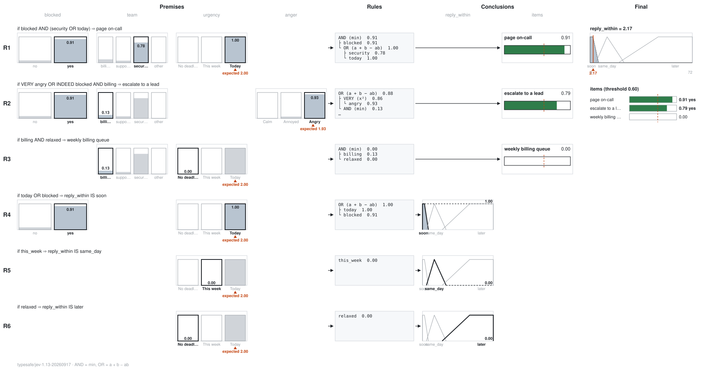

# Rules: how `rules.toml` works

Jev answers typed questions with probabilities. A **rules file** is a policy written over those
answers: you write the knowledge as `IF … THEN …` rules, and fuzzy logic works out how strongly the
policy supports each outcome for this particular state. This page covers the whole file, every
operator, how each number is computed, [what the numbers mean](#what-the-numbers-mean), what the
command prints, and the errors you can get.

- [How it fits together](#how-it-fits-together)
- [What the numbers mean](#what-the-numbers-mean)
- [A first file](#a-first-file)
- [The file at a glance](#the-file-at-a-glance)
- [`[terms]`: naming the answers](#terms-naming-the-answers)
- [`if`: the rule language](#if-the-rule-language)
- [`[logic]`: which AND and which OR](#logic-which-and-and-which-or)
- [`then`, `weight` and `[decide]`: items](#then-weight-and-decide-items)
- [`[output.NAME]`: a crisp amount](#outputname-a-crisp-amount)
- [Running it](#running-it)
- [Drawing it](#drawing-it)
- [A complete example, worked by hand](#a-complete-example-worked-by-hand)
- [Errors](#errors)
- [From Rust](#from-rust)
- [From Python](#from-python)
- [Designing rules](#designing-rules)

The examples are in [`examples/rules/`](../examples/rules):

| Questions | Rules | Shows |
| --- | --- | --- |
| [`weather.json`](../examples/rules/weather.json) | [`wear.toml`](../examples/rules/wear.toml) | Items, Scores, a Noul, `AND` / `OR` / `NOT` |
| [`rain.json`](../examples/rules/rain.json) | [`irrigation.toml`](../examples/rules/irrigation.toml) | An output: a crisp amount from fuzzy sets |
| [`triage.json`](../examples/rules/triage.json) | [`triage.toml`](../examples/rules/triage.toml) | All of it: a Choice, hedges, parentheses, a weight, `probsum`, a threshold, items and an output together |

Each example's questions define their levels concretely (Cold is under 10 °C, Scarce under 10 mm of
rain), and each output says its unit in a comment, since the file has no units of its own.

## How it fits together

```text
 state ──▶ Jev ──▶ answers ──▶ [terms] ──▶ degrees ──▶ [[rule]] if … ──▶ rule scores ──▶ items    (yes at the threshold)
 (text)     │     (probabilities)          (0 to 1)                                  └─▶ outputs  (a crisp value)
            └── questions.json
```

1. **Jev reads the state** and answers the questions in `questions.json`.
2. **`[terms]`** gives a short name to each answer the rules need. Each term reads one probability
   and uses it as a **degree** from 0 to 1.
3. **Each `[[rule]]`** combines degrees in its `if` with `AND`, `OR`, `NOT` and hedges into a
   **rule score**: how strongly the policy supports its `then`.
4. **Each `then`** is either an **item**, which is a yes when its score reaches the threshold, or a
   set of an **output**, which becomes a crisp value such as "2.17 hours".

The file is checked against the questions **before** Jev is called, so a mistake in it costs
nothing.

## What the numbers mean

Four kinds of number meet here, and only the first comes from Jev:

| Number | Meaning |
| --- | --- |
| `P(hot) = 0.8` | Jev gives 80% probability to the level Hot. |
| a term's degree 0.8 | The rules treat "hot" as holding to degree 0.8. |
| `raincoat` scores 0.8 | The policy supports a raincoat at 0.8. |
| `confidence` 0.8 | How peaked a Choice's or Score's distribution is. |

Using a probability as a fuzzy degree is a **modelling choice**, not something the numbers mean on
their own: a probability of 0.8 that it is hot is not "hot to degree 0.8". It is a useful heuristic,
and it is why a score is called **support**:

- **A score is not a probability**, and it isn't calibrated as one. Don't pass it on as "80%
  likely". `--json` keeps Jev's probabilities beside the outcome.
- **The operators are fuzzy, not probabilistic.** For `a = 0.8` and `b = 0.6` the probability of
  "both" could be anything from 0.4 to 0.6, depending on how the events relate; `min` gives 0.6 and
  `product` gives 0.48 only if they are independent, which answers about one state seldom are.
- **Levels of one question exclude each other.** The chance of "Today or This week" is the sum of
  their probabilities; `max` gives the larger one, and `probsum` less than the sum. `bounded` gives
  the sum. And "Today and This week" is 0 as a probability, whatever `min` says. Name the level you
  mean instead where you can: "neither Today nor This week" is the level No deadline.
- **Nothing is exclusive unless a rule makes it so.** With `raining` at 0.5, `raining` and
  `NOT raining` both score 0.5, and both are a yes at a threshold of 0.5. When two outcomes can't
  both happen, write what picks between them, and send a case near the threshold to a person.
- **A threshold is one policy for every item.** Paging someone and adding a tag rarely deserve the
  same bar: use a weight or a separate rules file for the costly action, and check it on reviewed
  cases.

Whether a rules file decides better than a plain threshold or a weighted score on your workflow is
something to measure on cases it wasn't tuned on. What it gives for certain is a policy you can read,
change and trace.

## A first file

The questions (`weather.json`):

```json
{
  "temp":     {"type": "score",
               "instructions": "How warm is it outside? Cold is under 10 °C, Mild 10 to 22 °C, Hot over 22 °C; …",
               "criteria": ["Cold", "Mild", "Hot"]},
  "humidity": {"type": "score",
               "instructions": "How humid is the air? Dry is under 40% relative humidity, Normal 40 to 70%, Humid over 70%; …",
               "criteria": ["Dry", "Normal", "Humid"]},
  "raining":  {"type": "noul",
               "instructions": "Is it raining, or about to?",
               "criteria": {"true": "Rain is falling, or the state says it is about to start", "false": "No rain, and none expected soon"}}
}
```

A term names a level by its exact text, so the definitions go in the instructions and the levels stay
short names. The rules (a shortened `wear.toml`):

```toml
[terms]
hot     = "temp.Hot"
raining = "raining"

[[rule]]
if   = "raining AND NOT hot"
then = "raincoat"
```

```sh
jev '16°C, the air feels sticky, and a light drizzle has started.' -q weather.json -r wear.toml
```

```text
raincoat  0.98  yes
threshold 0.50
```

Jev gave `raining` 0.98 and `hot` 0.00, so `raining AND NOT hot` = min(0.98, 1 − 0.00) = **0.98**.
That is at or over the default threshold of 0.5, so the policy supports a raincoat.

## The file at a glance

| Table | Required | Keys | Default |
| --- | --- | --- | --- |
| `[logic]` | no | `and` = `"min"`, `"product"` or `"lukasiewicz"`; `or` = `"max"`, `"probsum"` or `"bounded"` | `min`, `max` |
| `[decide]` | no | `threshold`: a number from 0 to 1 | `0.5` |
| `[terms]` | yes, for any rule to use a term | `name = "target"`, one per answer the rules read | |
| `[output.NAME]` | no | `range = [low, high]`, then one set per key: `set = [a, b, c]` or `[a, b, c, d]` | |
| `[[rule]]` | at least one | `if` (text), `then` (text), `weight` (0 to 1) | `weight = 1.0` |

Any other key is an error, so a typo such as `treshold` is caught rather than ignored.

## `[terms]`: naming the answers

A term is a **lowercase name** made of `a`–`z`, `0`–`9` and `_`, starting with a letter or `_`. It
points at one answer. Because terms are lowercase and operators are uppercase, neither can be
mistaken for the other.

| Question type | Target | The term's degree | Example |
| --- | --- | --- | --- |
| Noul | `id` | the probability of yes | `raining = "raining"` |
| Score | `id.Level` | that level's probability | `hot = "temp.Hot"` |
| Choice | `id.option` | that option's probability | `billing = "team.billing"` |

- **Exact text.** The level or option must be written exactly as in the questions, including case
  and spaces: `this_week = "urgency.This week"`. `temp.hot` doesn't match `Hot`, and the error lists
  the ones that exist.
- **Only what a question has.** A Score or Choice needs a level or option (`temp` alone is an
  error), and a Noul takes none (`raining.yes` is an error).
- **Dots in ids.** When one question id is a prefix of another (`weather` and `weather.temp`), the
  longer one wins, so `weather.temp.Hot` is `weather.temp`'s level.
- **Structured levels.** A level written as a JSON object has no text, so no term can name it.
- **Unused terms** are allowed, which helps while editing, but they are still checked.

Where the degree comes from, for the ticket in the [worked example](#a-complete-example-worked-by-hand):

```text
urgency: No deadline 0.00 · This week 0.00 · [Today 1.00]      today = "urgency.Today"        → 1.00
team:    billing 0.13 · support 0.08 · [security 0.78] · other 0.01    security = "team.security" → 0.78
blocked: no 0.09 · [yes 0.91]                                  blocked = "blocked"            → 0.91
```

Every answer is checked, and a problem is an error, never a guess. `jev` checks the whole reply
against the questions as soon as it arrives, whatever the output; the rules check again every
answer their terms read, for a reply that came some other way:

- An answer, or a probability a term needs, is missing: a zero would read as a confident "no" that
  nothing said. So is an answer of another type than its question. A reply `jev` receives must
  give every option and level its probability, since the endpoint sends the whole distribution.
- A number isn't a probability: outside 0 to 1, or not a number at all. It is not clamped. The
  same goes for a Choice's or a Score's `confidence`.
- A Choice's or Score's probabilities aren't a distribution that rounds to them. They arrive
  rounded to two places, so each could be up to 0.005 higher or lower; the check is whether some
  distribution adding up to exactly 1 is that close to every one of them. `[0.33, 0.33, 0.33]`
  passes; `[0.51, 0.51, 0, 0]` doesn't, since the two 0.51s were at least 0.505 each.
- A Choice's `choice` isn't its most probable option (allowing a tie rounding made), or a Score's
  `score` is an expected level its probabilities can't give.
- The reply names a level or option the question doesn't have, or writes a level other than
  plainly (`"00"` for `"0"`).

## `if`: the rule language

### Operators

| Operator | Meaning | Degree | `a = 0.8`, `b = 0.6` |
| --- | --- | --- | --- |
| `a AND b` | both | set by `[logic] and` (default `min(a, b)`) | 0.6 |
| `a OR b` | either | set by `[logic] or` (default `max(a, b)`) | 0.8 |
| `NOT a` | not | `1 − a` | 0.2 |
| `( … )` | grouping | the inside's degree | |

### Hedges

A hedge reshapes a term's degree, or a group's in parentheses. It moves where the threshold falls,
and that is all it does.

| Hedge | Degree | `a = 0.7` | `a = 0.3` | Passes 0.5 when |
| --- | --- | --- | --- | --- |
| `VERY a` | a² | 0.49 | 0.09 | a ≥ √0.5 ≈ 0.7071 |
| `EXTREMELY a` | a³ | 0.34 | 0.03 | a ≥ ∛0.5 ≈ 0.7937 (0.79 doesn't: 0.79³ = 0.493) |
| `SOMEWHAT a` | √a | 0.84 | 0.55 | a ≥ 0.25 |
| `INDEED a` | 2a² when a ≤ 0.5, else 1 − 2(1 − a)² | 0.82 | 0.18 | a ≥ 0.5 (it pushes away from 0.5, and leaves 0.5 where it is) |

The names come from fuzzy logic, where "very hot" squares a membership in "hot". Here the degree is
a probability, so `VERY angry` squares the probability of the level Angry: it asks for more
certainty, and it can't tell an angry message from a furious one, which both get probability 1.
If intensity matters, give the question a level for it, or ask a separate question. `INDEED` adds
no evidence either: it makes a number look more certain than the answer was.

### Precedence

From tightest to loosest:

1. **Hedges and `NOT`** apply to the next term or group: `NOT VERY hot` is `NOT (VERY hot)`.
2. **`AND`**.
3. **`OR`**: `cold OR raining AND humid` is `cold OR (raining AND humid)`.

Use parentheses whenever you mean something else: `(cold OR raining) AND humid`.

Keep in mind that `AND` binds tighter than `OR`. The triage rule
`VERY angry OR INDEED blocked AND billing` reads as `(VERY angry) OR ((INDEED blocked) AND billing)`.

### Grammar

```text
rule   = or
or     = and { "OR" and }
and    = unary { "AND" unary }
unary  = ( "NOT" | "VERY" | "SOMEWHAT" | "EXTREMELY" | "INDEED" ) unary | atom
atom   = term | "(" or ")"
term   = [a-z_] [a-z0-9_]*          (defined in [terms])
```

- Words are separated by spaces and brackets: `(hot)` and `( hot )` are the same.
- Operators are **uppercase only**. A lowercase `and` gets an error that points you to `AND`,
  rather than being read as a term.
- An `if` may be up to **256 words and brackets** long. Beyond that, split it into several rules
  with the same `then`, which are joined by OR anyway.

## `[logic]`: which AND and which OR

`[logic]` picks one AND and one OR for the whole file. The same OR joins conditions inside a rule,
joins rules with the same `then`, and merges an output's sets. None of them is the probability of
a compound event ([why](#what-the-numbers-mean)).

| `and` | Formula | 0.8 AND 0.6 | What it does |
| --- | --- | --- | --- |
| `min` (default) | `min(a, b)` | 0.60 | The weakest condition decides; a condition written twice counts once. |
| `product` | `a × b` | 0.48 | Every weak condition lowers the result. |
| `lukasiewicz` | `max(0, a + b − 1)` | 0.40 | Strict: high only when both are. |

| `or` | Formula | 0.8 OR 0.6 | What it does |
| --- | --- | --- | --- |
| `max` (default) | `max(a, b)` | 0.80 | The strongest reason decides; a second reason, or the same one twice, adds nothing. |
| `probsum` | `a + b − ab` | 0.92 | Reasons reinforce each other. A reason written twice counts twice (0.6 becomes 0.84), so keep it for distinct evidence. |
| `bounded` | `min(1, a + b)` | 1.00 | Reasons add up, capped at 1. For levels or options of one question, which exclude each other, that is their probabilities' sum. |

The usual pairs are `min` with `max`, `product` with `probsum`, and `lukasiewicz` with `bounded`.
With another pairing, a rule rewritten by De Morgan's law can score differently: under `min` and
`probsum`, `NOT (a AND b)` is 0.40 for the numbers above, and `NOT a OR NOT b` is 0.52.

## `then`, `weight` and `[decide]`: items

A `then` that isn't `OUTPUT IS SET` names an **item**: any text, such as `raincoat` or
`page on-call`. Three words with `IS` in the middle always mean an output, so write an item's
name another way (`request is urgent`).

```toml
[decide]
threshold = 0.6            # an item is a yes at or over this; default 0.5

[[rule]]
if     = "VERY angry OR INDEED blocked AND billing"
then   = "escalate to a lead"
weight = 0.9               # the rule's score is its if × 0.9; default 1.0
```

- **A rule's score** is what its `if` comes to, times its `weight`. Use a weight below 1 for a rule
  you trust less than the others.
- **Several rules with the same `then`** are joined by the file's OR. With `max`, the strongest
  rule decides; with `probsum`, they add up, so two rules that restate one reason count it twice.
- **An item is a yes** when its score is at or over `threshold`.
- **Items print in the order** the file first names them.

## `[output.NAME]`: a crisp amount

An item answers yes or no. When the answer is an **amount** ("how many hours until we reply?",
"how much to water?"), conclude in an **output** instead.

```toml
[output.reply_within]            # the name: lowercase, as a term's. The unit is hours.
range    = [0, 72]               # the axis: low, high
soon     = [0, 0, 2, 6]          # a set: a trapezoid a, b, c, d
same_day = [4, 12, 24]           # a set: a triangle a, peak, c
later    = [20, 48, 72, 72]      # a set: a shoulder that holds to the end

[[rule]]
if   = "today OR blocked"
then = "reply_within IS soon"    # OUTPUT IS SET
```

### Sets

A set is a shape on the output's axis that says how much each point belongs to it.

| Written | Shape | Belongs fully | |
| --- | --- | --- | --- |
| `[a, peak, c]` | triangle | at `peak` | rises from `a`, falls to `c` |
| `[a, b, c, d]` | trapezoid | from `b` to `c` | rises from `a` to `b`, falls from `c` to `d` |
| `[a, a, c, d]` | left shoulder | from `a` | e.g. `soon = [0, 0, 2, 6]` |
| `[a, b, d, d]` | right shoulder | up to `d` | e.g. `later = [20, 48, 72, 72]` |
| `[p, p, p]` | a single point | only at `p` | |

The points must be in order along the axis and inside `range`. Sets are drawn and listed in order
along the axis, whatever order the file has them in. An output's sets are **all shapes or all
points**: a point has no area to weigh against a shape's, so a mix is refused. Whether
**neighbouring sets overlap** is a choice your policy makes: overlapping sets let support for two
of them give a value between the two. (A Score's levels don't overlap in this sense: they exclude
each other, even when several have some probability.)

### How the value is computed

This is Mamdani inference with centroid defuzzification:

1. **Score each set.** Every rule that concludes `OUTPUT IS SET` has a score. A set's score is the
   OR of its rules' scores.
2. **Clip each set once**, at its score: the shape, cut flat at that height. The score the outcome
   reports, the shape drawn and the shape the value comes from are the same thing.
3. **Merge** the clipped shapes with the file's OR, point by point along the axis.
4. **Take the centroid**, the balance point of the merged shape. That is the output's value.

The centroid is worked out analytically, not sampled: between two neighbouring corners or clip
points every clipped set is a straight line, so the merged shape is a polynomial on each piece
(once `max`'s crossings and `bounded`'s reaching 1 are cut out). Under `max` and `bounded` each
piece is straight and its area and balance point have a closed form; under `probsum` the piece is
evaluated as `−expm1(Σ ln(1 − a))`, which keeps a tiny support, and integrated with enough
Gauss–Legendre points to be exact for its degree. The range is scaled to 0–1 first, so a wide one
can't overflow. What is left is ordinary floating-point rounding, and a result the arithmetic
can't make finite is an error (`[output.y] has no value: …`), never taken for no support. A set
that is narrow next to its range counts in full.

| Situation | Value |
| --- | --- |
| At least one set scores above 0 | the centroid, e.g. `2.17` |
| No rule for this output scores above 0 | none: `-` in text, `null` in JSON |
| The sets are points | the points' average, each weighted by its set's score |

**Read the value with its sets' scores.** The value says where the support lies, not how much there
is: `same_day` clipped at 0.01 alone gives 13.99 hours, and at 1.00 it gives 13.33. The text output prints every
set's score beside the value, and JSON has them too, so gate on them before acting on the value.

**A value can fall between two sets that neither supports.** If the rules support `soon` and
`later` equally, the centroid lands near the middle of the axis, where neither has support. That
compromise may be what you want or a poor answer; when it isn't wanted, make the rules choose one
set. A hard limit, such as a contractual reply deadline, belongs in code: averaging deadlines
enforces none of them.

`then = "X IS Y"` always concludes in an output, so `X` must be an `[output.X]` the file declares.
A misspelt name is an error that suggests the closest one, rather than an item that quietly takes
the rule.

## Running it

```sh
jev STATE -q questions.json -r rules.toml [--table | --json | --graph] [--svg FILE] [--dry-run]
```

| Flag | What you get |
| --- | --- |
| *(none)* | one line per item, then the threshold, then one line per output |
| `--table` | a table with every rule behind each score |
| `--json` | `{"reply": …, "outcome": …}`: Jev's full reply and the outcome |
| `--graph` | the rules drawn in the terminal ([below](#drawing-it)) |
| `--svg FILE` | the rules drawn as an image; works alongside any of the others |
| `--dry-run` | print the request instead of sending it; the rules are still checked |

The state comes as an argument, from `-f FILE`, or on standard input. The rules may come from
standard input too (`-r -`), as long as the state and the questions don't.

### Text

```text
page on-call          0.91  yes
escalate to a lead    0.79  yes
weekly billing queue  0.00
threshold 0.60
reply_within          2.17  (soon 1.00, same_day 0.00, later 0.00)
617 tokens in, 89 out, $0.000026, typesafe/jev-1.13-20260917
```

### `--table`

```text
┌──────────────────────┬───────┬──────┬──────────────────────────────────────────────────────────────────────┐
│ item                 │ score │ yes? │ rules                                                                │
├──────────────────────┼───────┼──────┼──────────────────────────────────────────────────────────────────────┤
│ page on-call         │ 0.91  │ yes  │ blocked AND (security OR today) = 0.91                               │
│ escalate to a lead   │ 0.79  │ yes  │ VERY angry OR INDEED blocked AND billing = 0.79                      │
│ weekly billing queue │ 0.00  │      │ billing AND relaxed = 0.00                                           │
│ reply_within         │ 2.17  │      │ soon: today OR blocked = 1.00; same_day: this_week = 0.00; later:    │
│                      │       │      │ relaxed = 0.00                                                       │
└──────────────────────┴───────┴──────┴──────────────────────────────────────────────────────────────────────┘
threshold 0.60
```

Separate calls can move the numbers slightly, so set thresholds with a margin.

### `--json`

The `outcome` part (`reply` is Jev's answer, as this crate reads it: the fields it knows, re-encoded):

```json
{
  "threshold": 0.6,
  "items": [
    {
      "item": "page on-call",
      "score": 0.91,
      "yes": true,
      "rules": [{"if": "blocked AND (security OR today)", "weight": 1.0, "score": 0.91}]
    }
  ],
  "outputs": [
    {
      "output": "reply_within",
      "value": 2.166666666666667,
      "sets": [
        {"set": "soon", "score": 1.0, "rules": [{"if": "today OR blocked", "weight": 1.0, "score": 1.0}]},
        {"set": "same_day", "score": 0.0, "rules": [{"if": "this_week", "weight": 1.0, "score": 0.0}]}
      ]
    }
  ]
}
```

| Field | |
| --- | --- |
| `threshold` | from `[decide]` |
| `items[]` | `item`, `score`, `yes`, and `rules[]`: each rule's `if`, `weight` and score |
| `outputs[]` | only when the file has outputs: `output`, `value` (a number, or `null`), and `sets[]` in axis order, each with its `score` and `rules[]` |

Scores aren't rounded in JSON, so round them yourself when you print them:
`jq '.outcome.items[] | {item, score: (.score * 100 | round / 100), yes}'`.

## Drawing it

Without a state (or with `--dry-run`), both drawings show the structure only and make no call. That
is a free way to review a rules file.

```sh
jev -q examples/rules/triage.json -r examples/rules/triage.toml --graph           # structure, no call
jev -f ticket.txt -q examples/rules/triage.json -r examples/rules/triage.toml --graph --svg triage.svg
```

### `--svg`



- **Premises** (left): one column per question, with a bar per level, option, or no and yes, filled
  to its probability. The one a rule reads is in bold, with its number.
  - Under a Score, the red arrow is its expected level (`expected 2.00`). It is drawn apart from the
    bars because the rules don't read it, and it can't stand for them: `[0, 1, 0]` and
    `[0.5, 0, 0.5]` both expect level 1.
  - A probability the reply leaves out is marked `missing`, not drawn as 0.
- **Rules**: the `if` as a tree of its operators, each with its value. A tree too tall for its box
  ends in `…`; `--graph` always shows the whole tree.
- **Conclusions**: an output's sets with the rule's own set clipped at its score, or an item's bar
  with the threshold as a dashed line.
- **Final** (right): each output's merged shape with an arrow at its centroid, and every item's
  score against the threshold.

### `--graph`

Every node shows its value, and every term shows where its degree came from, with every level's or
option's probability and the term's own in brackets:

```text
R2  VERY angry OR INDEED blocked AND billing  ⇒  escalate to a lead
    OR (a + b − ab)  0.88
    ├─ VERY (x²)  0.86
    │  └─ angry  0.93  ← anger: Calm 0.00 · Annoyed 0.07 · [Angry 0.93]
    └─ AND (min)  0.13
       ├─ INDEED (toward 0 or 1)  0.98
       │  └─ blocked  0.91  ← blocked: no 0.09 · [yes 0.91]
       └─ billing  0.13  ← team: [billing 0.13] · support 0.08 · security 0.78 · other 0.01
    ⇒ escalate to a lead  0.79 (× weight 0.9)  ███████████████▉
```

An output is drawn as a plot. `░` is every set's outline, the blocks are the merged shape, and `↑`
marks the centroid:

```text
  reply_within = 2.17
  1.0 ┤██▄       ░                           ░░░░░░░░░░░░░░░░░░░░░░
      │███     ░░░░░                    ░░░░░░░░░░░░░░░░░░░░░░░░░░░
      │███▇   ░░░░░░░░             ░░░░░░░░░░░░░░░░░░░░░░░░░░░░░░░░
      │████▃ ░░░░░░░░░░░       ░░░░░░░░░░░░░░░░░░░░░░░░░░░░░░░░░░░░
      │█████░░░░░░░░░░░░░░░░░░░░░░░░░░░░░░░░░░░░░░░░░░░░░░░░░░░░░░░
  0.0 └──┬─────────────────────────────────────────────────────────
       0 ↑ 2.17                                                  72
       soon  same_day                                 later
```

## A complete example, worked by hand

[`triage.toml`](../examples/rules/triage.toml) against this ticket:

> Our card was declined twice this morning and now the whole account is locked. Nobody on the team
> can log in and payroll runs at 5pm today. This is the third time this month. Fix it NOW.

```toml
[logic]
and = "min"
or  = "probsum"            # distinct reasons to act add up; a reason written twice counts twice

[decide]
threshold = 0.6            # act only on a fairly clear yes

[terms]
billing   = "team.billing"          # a Choice option
security  = "team.security"
relaxed   = "urgency.No deadline"   # a Score level whose text has a space
this_week = "urgency.This week"
today     = "urgency.Today"
angry     = "anger.Angry"
blocked   = "blocked"               # a Noul

[[rule]]
if   = "blocked AND (security OR today)"
then = "page on-call"

[[rule]]
if     = "VERY angry OR INDEED blocked AND billing"
then   = "escalate to a lead"
weight = 0.9

[[rule]]
if   = "billing AND relaxed"   # not NOT (today OR this_week): see R3 below
then = "weekly billing queue"

[output.reply_within]      # hours until the first reply
range    = [0, 72]
soon     = [0, 0, 2, 6]
same_day = [4, 12, 24]
later    = [20, 48, 72, 72]

[[rule]]
if   = "today OR blocked"
then = "reply_within IS soon"

[[rule]]
if   = "this_week"
then = "reply_within IS same_day"

[[rule]]
if   = "relaxed"
then = "reply_within IS later"
```

**What Jev said** (the degrees): `blocked` 0.91, `security` 0.78, `billing` 0.13, `today` 1.00,
`this_week` 0.00, `relaxed` 0.00, `angry` 0.93.

**R1, page on-call.** `security OR today` with probsum = 0.78 + 1.00 − 0.78 × 1.00 = 1.00. Then
`blocked AND 1.00` = min(0.91, 1.00) = **0.91**. That is ≥ 0.6, so **yes**.

**R2, escalate to a lead.**
- `VERY angry` = 0.93² = 0.86.
- `INDEED blocked` = 1 − 2 × (1 − 0.91)² = 0.98.
- `INDEED blocked AND billing` = min(0.98, 0.13) = 0.13. `AND` binds tighter than `OR`, so it is
  worked out first.
- `0.86 OR 0.13` with probsum = 0.86 + 0.13 − 0.86 × 0.13 = 0.88.
- Times the weight: 0.88 × 0.9 = **0.79**, so **yes**.

**R3, weekly billing queue.** `billing AND relaxed` = min(0.13, 0.00) = **0.00**, so **no**: this
ticket is urgent, not one for the weekly queue. The rule names the level `relaxed` (No deadline)
rather than `NOT (today OR this_week)`. The levels exclude each other, so "neither Today nor This
week" is exactly No deadline. `today OR this_week` under probsum would treat them as separate
reasons instead: for an answer split `[0, 0.5, 0.5]` it gives 0.75, so `NOT` it would be 0.25 when
no probability at all is on No deadline.

**R4–R6, reply_within.**
- `soon` is clipped at `today OR blocked` = 1.00 + 0.91 − 0.91 = **1.00**.
- `same_day` is clipped at 0.00, and so is `later`.
- The merged shape is therefore `soon` itself: 1 from 0 to 2, falling to 0 at 6.
- Its centroid: the flat part (area 2, centre 1) plus the slope (area 2, centre 2 + 4/3 ≈ 3.33)
  gives (2 × 1 + 2 × 3.33) / 4 = 13/6 = **2.17 hours**, which is what the command prints.

## Errors

Every error is found before the call, except the ones marked *from the reply*. Each message names the rule by number and quotes its `if`.

| Mistake | Message |
| --- | --- |
| a level that doesn't exist | ``[terms] hot: `temp` has no level `hot`; its levels are `temp.Cold`, `temp.Mild`, `temp.Hot` `` |
| an option that doesn't exist | ``[terms] s: `team` has no option `Billing`; its options are `team.billing`, … `` |
| a Score or Choice without a level | ``[terms] t: `temp` is a score: name one of its levels, as `temp.Cold`, … `` |
| a Noul with a level | ``[terms] r: `raining` is a noul, which has no levels or options: write `raining` alone `` |
| a question that isn't asked | ``[terms] w: no question `wind`; the questions are humidity, raining, temp `` |
| a capital in a term's name | ``[terms] `Hot`: a term is a lowercase word of letters, digits and `_` … `` |
| a term not in `[terms]` | ``rule 1 (`wet`): `wet` isn't in [terms], which names hot, raining `` |
| a lowercase operator | ``rule 1 (`raining and hot`): `and` isn't in [terms]; the operator is written AND `` |
| an unknown operator | ``rule 1 (`raining XOR hot`): `XOR` isn't an operator: operators are AND, OR, NOT, VERY, SOMEWHAT, EXTREMELY, INDEED `` |
| a missing operator | ``rule 1 (`raining hot`): `hot` where AND or OR should be `` |
| a missing term | ``rule 1 (`raining AND`): it ends where a term should be `` |
| brackets | `` a `(` that isn't closed ``, `` a `)` with no `(` before it `` |
| an `if` that is too long | ``it is 399 words and brackets long, over the 256 a rule may have; split it …`` |
| an empty `if` or `then` | `` the `if` is empty ``, `` the `then` is empty `` |
| a weight or threshold outside 0–1 | `the weight is 2; it goes from 0 to 1`, `[decide] threshold is 1.5; it goes from 0 to 1` |
| no rules | ``no rules: add a [[rule]] with an `if` and a `then` `` |
| an unknown key or `[logic]` value | TOML's own message, naming the key and the values it accepts |
| an output that isn't declared | ``rule 2 (`regular`): `wter IS some` concludes in an output, and there is no [output.wter]; did you mean `water IS some`?`` |
| an output's set that doesn't exist | ``[output.water] has no set `lots`; its sets are some `` (with `did you mean` for a near miss) |
| an output's range | `[output.water] range is [10.0, 0.0]; it is two numbers, lowest first: range = [0, 100]` |
| an output's set | `medium has 2 points; a set is [a, b, c] …`, `goes outside the range`, `points go down somewhere` |
| points and shapes in one output | `[output.water] mixes a point (exact) with a set that has width (some) …` |
| *from the reply:* an answer is missing | ``no answer for question `raining` `` |
| *from the reply:* a probability is missing | ``question `team` gives no probability for `storm` `` |
| *from the reply:* an answer isn't probabilities | ``the answer to question `raining` can't be read: the probability of yes is 1.2, which isn't a probability from 0 to 1`` |
| | ``… its probabilities add up to 1.020, which no distribution rounds to``, ``… it gives a probability for `hail`, which isn't one of the question's options`` |
| | ``… its expected level is 2, which its probabilities can't give: they allow 0.00 to 0.01``, ``… it chose `a` at 0.2, while another option has 0.8`` |
| a level named twice | ``[terms] high: `q` has the level `High` 2 times (levels 1 and 2), so a term can't say which …`` |
| *from the arithmetic:* an output too extreme to add up | ``[output.y] has no value: its sets have support, but their shape's area came to 0 …`` |

## From Rust

The engine is `jev::rules`, behind the `command` feature (the CLI's default).

```toml
[dependencies]
jev = { package = "fuzzy-jev", version = "0.3", default-features = false, features = ["command"] }
```

```rust
use jev::rules::Rules;

let questions = jev::spec::questions_file(&std::fs::read_to_string("triage.json")?)?;
let rules = Rules::parse(&std::fs::read_to_string("triage.toml")?, questions.iter().map(|(id, q)| (id.as_str(), q)))?;

let reply = jev::Client::new(&key).decide(ticket, questions).await?;
let outcome = rules.evaluate(&reply)?;

for item in &outcome.items {
    if item.yes {
        println!("{}: {:.2}", item.item, item.score);
    }
}
if let Some(hours) = outcome.outputs[0].value {
    println!("reply within {hours:.1} hours");
}
std::fs::write("triage.svg", rules.graph_svg(Some(&reply))?)?;
```

| Function | Returns |
| --- | --- |
| `Rules::parse(text, questions)` | the checked rules, or the error message as a `String` |
| `rules.evaluate(&reply)` | an `Outcome`, or `jev::Error` when the reply lacks an answer or a probability, or has one that isn't a probability (`Error::BadAnswer`) |
| `rules.graph_text(Some(&reply))` / `graph_text(None)` | the `--graph` drawing, with numbers or the structure only |
| `rules.graph_svg(Some(&reply))` / `graph_svg(None)` | the `--svg` drawing |
| `outcome.text()` | the text the command prints |
| `jev::print::render_outcome(format, &reply, &outcome, width)` | the command's text, table or JSON |

`Outcome` has `threshold`, `items: Vec<Item>` (`item`, `score`, `yes`, `rules`) and
`outputs: Vec<OutputValue>` (`output`, `value: Option<f64>`, `sets`). Each rule entry is a `Fired`
(`when`, `weight`, `score`), serialized with the key `if`.

## From Python

The same engine, from `pip install fuzzy-jev`:

```python
import jev

questions = jev.load_questions(open("triage.json").read())
rules = jev.Rules(open("triage.toml").read(), questions)   # RulesError if it doesn't fit

reply = jev.Client().decide(ticket, questions)
outcome = rules.evaluate(reply)
for item in outcome.items:
    if item.yes:
        print(f"{item.name}: {item.score:.2f}")
hours = outcome["reply_within"].value     # None when no rule concluding it fired
if hours is not None:
    print(f"reply within {hours:.1f} hours")
open("triage.svg", "w").write(rules.graph_svg(reply))
```

[`python.md`](python.md#rules) has the rest.

## Designing rules

1. **Ask graded things as Scores** with named levels (`Cold | Mild | Hot`), 3–5 each. Keep Nouls
   for things that are simply true or false.
2. **Write one rule per piece of know-how**, in the owner's words: "a raincoat when it rains, unless
   it's hot" becomes `raining AND NOT hot`.
3. **Check coverage.** Walk the combinations (cold / mild / hot × raining or not) and make sure some
   rule speaks for each. A gap is a situation with no outcome.
4. **Look for conflicts** between two rules that say opposite things about one situation. Decide
   which one wins, or add an outcome for the case where both hold.
5. **Review the structure for free** with `--graph` and no state, then **tune on real states**: run
   ten or twenty, and fix a rule, a weight or the threshold, never the answers. That is debugging,
   not evidence that the rules work.
6. **Leave `[logic]` at `min` and `max`** unless you want reasons to add up, and then check that
   no two rules restate one reason.
7. **Name exclusive levels directly.** Where "neither of these levels" is itself a level, use it,
   or join levels of one question with `bounded`.
8. **Evaluate before relying on it.** Keep a set of reviewed cases the rules weren't tuned on, and
   compare the rules with a plain threshold or a weighted score on them: count the costly false
   yeses and noes, and how many cases each sends to a person.
